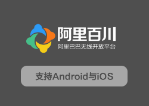

# APICloud-mAliBaiChuan

此模块为APICloud自定义模块，集成后可在APP内实现阿里妈妈跟单、淘宝授权免登等等

## 为何会有这个Repositories

* **重复授权收费**：APICloud的收费模块授权只能是一对一，如果你想在两个或者三个甚至更多应用中集成，需要一个个购买
* **售后及集成困难**：由于APICloud用户集成模块时，与模块开发者不是直接关系，这势必会导致，当集成与使用出现问题或者其他的时候，发现找不到模块作者
* **更新缓慢**：往往模块开发者提交模块到apicloud审核时，可能会耗时1个星期左右

## 如何使用与集成这个模块

* 请跳转至[说明.md](./说明.md)阅读详细细节

## 如何购买

[去淘宝](https://item.taobao.com/item.htm?id=564886527196)

## 如何联系到我

QQ(注明来意):[401828628](http://wpa.qq.com/msgrd?v=3&uin=906157429&site=qq&menu=yes)

个人博客：[http://www.maochunjie.com](http://www.maochunjie.com)
